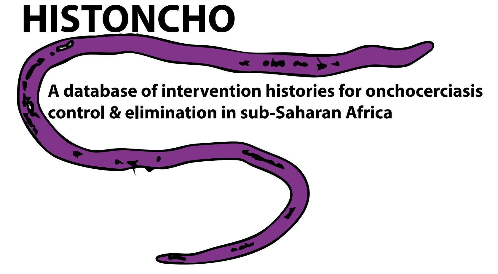

---

<!-- badges: start -->

<!-- badges: end -->

 

---

## Table of Contents

-   [Overview](#overview)
-   [Installation](#installation)
-   [Usage](#usage)
-   [Contributing](#contributing)
-   [License](#license)

---

## Overview

A database of intervention histories for onchocerciasis control and elimination in sub-Saharan Africa. 
This Readme provides guidance for using this repository for compiling the HISTONCHO dataframe and 
preparing figures in support of the pre-print publication:

[Dixon MA, Walker M, Ramani A, Coalson JE, Griswold E, Noland GS, Tata A, Makata E, Ali AMA, Bessell P, Fronterrè C, Browning R, Stolk WA, Basáñez M-G. HISTONCHO: A database of intervention histories for onchocerciasis control & elimination in sub-Saharan Africa. MedRxiv. 2025. Preprint available at: https://www.medrxiv.org/content/10.1101/2025.05.19.25327763v1](https://www.medrxiv.org/content/10.1101/2025.05.19.25327763v1)

---

## Installation

Clone the repository through: 

git clone https://github.com/mrc-ide/HISTONCHO.git 

---

## Usage

### Step 1: Load libraries 
Using the [Libraries](/Libraries.R) script, load all relevant Libraries to run all scripts. Where necessary, install new packages. 

### Step 2: aligining Implementation Units (IU)
IUs found in the Expanded Special Project for Elimination of Neglected Tropical Diseases (ESPEN) database for the years 2013-2022 can split over this period into smaller IUs (while the original, or 'parent' IU may remain, albeit as a smaller geographical unit). Aligning these IUs, by back-filling entries for the sub-divided IUs is an important step to ensure that all IUs have entries between 2013-2022. The code to perform this step can be found in [Aligning_IUs_script](/Aligning_IUs_script.R) script (Author: Paul Bessell).

### Step 3: Compiling the Onchocerciasis Control Programme (OCP) intervention histories
First, load all necessary function found in the [Compiling_oncho_histories_OCP_functions](/Compiling_oncho_histories_OCP_functions.R) script. After this, you can run the compilation code which will build the intervention histories for all implementation units in West Africa (excluding Liberia) using the [Compiling_oncho_histories_OCP_master](Compiling_oncho_histories_OCP_master.R) script. Input data to support compiling IU histories for OCP countries can be found in the [input data](/input data) folder.

### Step 4: Compiling the African Programme for Onchocerciasis Control (APOC) intervention histories
Load all necessary function found in the [Compiling_oncho_histories_APOC_functions](/Compiling_oncho_histories_APOC_functions.R) script. After this, you can run the compilation code which will build the intervention histories for all implementation units in central and east Africa (including Liberia) using the [Compiling_oncho_histories_APOC_master](Compiling_oncho_histories_APOC_master.R) script. Input data to support compiling IU histories for APOC countries can be found in the [input data](/input data) folder.

### Step 5: Combining OCP and APOC intervention history dataframes
To create the final HISTONCHO database, we need to combine the OCP and APOC intervention histories dataframes. First run the [Combining_cleaning_HISTONCHO_function](/Combining_cleaning_HISTONCHO_function.R) script to call all of the function neccessary, then run the [Combining_cleaning_HISTONCHO_script](/Combining_cleaning_HISTONCHO_script.R).

### Step 6: Plot figures 
We now have the final HISTONCHO database compiled, we are able to plot the figures (1, 5, 6, 7 & 8) associated with the pre-print [Dixon et al.](https://www.medrxiv.org/content/10.1101/2025.05.19.25327763v1) highlighted above. Call the plotting functions in [Figures_code_HISTONCHO_functions](/Figures_code_HISTONCHO_functions.R) script and then plot using [Figures_code_HISTONCHO](/Figures_code_HISTONCHO.R) script. The plots will be saved in the [plots](/plots) folder.

---

## Contributing

Code for the aligning the IUs in ESPEN has been provided by Paul Bessel. Data inputs (adapted) have been provided by Jorge Cano (ESPEN), the Federal Ministry of Health & Social Welfare (Federal Republic of Nigeria) and Republic of the Sudan Federal Ministry of Health, supported by The Carter Center and Sightsavers. Wilma A. Stolk, Raiha Browning and Claudio Fronterrè have also provided data which have been further proceesed to include as data inputs in the [input data](/input data) folder.

Further contributions can be made through pull requests. 

---

## License

This project is licensed under the Creative Commons Zero v1.0 Universal License - see the [LICENSE](LICENSE) file for details.

--- 

## Last Updated

This README was last updated on 28-05-2025

